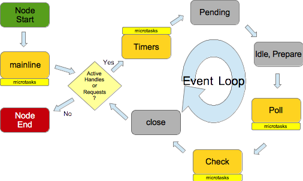
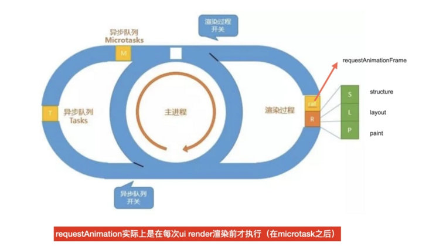

---

title: JS异步
date: 2021-09-21
tags: 

- JavaScript

categories:

 - 前端

---

## 序言

异步在计算机领域是个很普遍的概念，从硬件上的多处理器，操作系统的分时系统，异步性在计算机系统本身具有的属性。异步性可以使程序执行更有效率，但也同时增加了程序的复杂度。JS语言为什么设计成单线程、非IO阻塞型呢？由于浏览器网页和用户具有很多交互行为，这些行为的处理通过事件处理函数来处理，情况很多很复杂，采用单线程负责计算和渲染能够简化模型。而设计成非IO阻塞型是为了利用计算机的异步性，防止单线程用于长时间的运算而导致的页面的卡顿。那么这门单线程、非IO阻塞型的语言的运行机制是怎样的呢？

## 1 事件循环(Event Loop)

### 1.1 浏览器环境

~~有一个主线程和两种异步队列，主线程在执行代码中，遇到异步任务会把异步任务放到对应的异步队列，接着继续执行主线程的代码。当主线程的代码执行完，js引擎去取一个已准备好的异步任务来执行。具体是：先去微任务队列取一个微任务，如果微任务队列已取完就去宏任务队列取一个宏任务。~~

微任务：

- 已解决或已拒绝的 Promise 的 then() 处理函数

宏任务：

- script标签代码
- setTimeout、setInterval
- I/O操作、UI交互
- (postMessage)

### 1.2 Node环境

Node.js和浏览器的事件循环原理类似，数据结构都有一个主线程，和其他的异步队列组成。当主线程代码执行完，就依次去这些异步队列查找可处理的回调函数，找到了就将这个回调函数放到主线程来执行。当主线程代码执行完或者某个阶段的队列任务为空了，就会去执行当前所有的微任务。

1 Timers阶段
timeout类型的计时器有两个：setInterval、setTimeout。

2 Pending阶段
一些系统级回调将会在此阶段执行，只需要知道它的存在就行了。

3 Idle和Prepare阶段
此阶段仅供内部使用，只需要知道它的存在就行了。

4 Poll阶段
I/O回调在此阶段执行。

5 Check阶段
只有setImmediate()回调会在该阶段中执行。

6 Close阶段
如果某个套接字或句柄突然关闭（例如，调用了socket.destroy()方法）,则会执行此阶段，这种情况下会触发其“close”事件。

微任务回调
微任务回调是process.nextTick或Promise.resolve().then()的回调，会在主线程或事件循环的某个阶段执行。调度微任务后，它们会加入在该阶段完成后执行的微任务回调队列中。

## 2 Promise

Promise是异步编程的一种解决方案。
说一下开发的一些需要注意的地方：

- 一般来说，不要在then()方法里面定义Reject状态的回调函数，而总是使用catch方法。
- 如果没有使用catch()方法，Promise对象抛出的错误不会影响到Promise外部的代码，通俗的说法是“Promise会吃掉错误”。
- 善于运用all()、race()方法。
- 善于运用Promise.resolve()方法。

## 3 Async

async函数的实现原理不必了解。基本用法是，函数需要加async关键字，函数内部的异步操作需要加await关键字。
异常处理需要多加注意：
await后的异步操作或者async函数内部的代码，只要出现异常就会抛出异常给外层代码，而如果使用了catch之后就不会。

## 4 事件循环机制与UI渲染引擎的关系

这里需要对事件循环机制重新了解。

涉及到的一些概念如：同步任务，异步任务，一个循环的开始，一个循环的结束，宏任务队列，微任务队列，本次循环，下一次循环，渲染UI。异步任务包含宏任务和微任务。同步任务只是一个相对概念。

首先一个循环是执行宏任务队列里的一个宏任务。循环的开始是从宏任务队列里拿到一个宏任务A作为开始，然后执行这个宏任务A，遇到宏任务则把它加到宏任务队列，遇到微任务把这个微任务加到微任务队列。宏任务A里的同步任务代码执行完，然后再把微任务队列清空，清空微任务队列后，就去更新dom，去渲染UI，渲染UI完成则本次循环结束。去拿下一个宏任务作为下一次循环的开始。

上面那个循环图的开关何时是开启状态、道路可以看作事件循环机制。浏览器主动渲染UI即把待渲染内容放到显存，然后系统每秒/60次的拿显存更新显示屏，如果程序执行能在显示屏更新前把显存的内容准备好，那么动画就是运行正常的。

