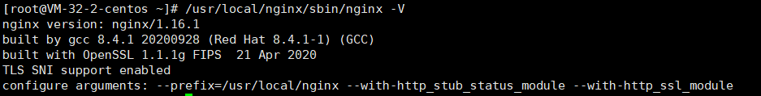

**1、首先切换到 `/usr/local` 目录下（这个是用户级的应用程序目录，用户自己编译的软件默认会安装到这个目录下）**

```bash
cd /usr/local
```

**2、下载 Nginx 安装包**

用 yum 安装一个包管理工具 wget：

```bash
yum install wget -y
```

接着下载 Nginx 的源码包：

```
wget http://nginx.org/download/nginx-1.20.2.tar.gz
```

Nginx 的最新版本可以到 [Nginx官网](http://nginx.org/en/download.html) 获取

**3、解压 Nginx 源码包**

```bash
tar -zxvf nginx-1.20.2.tar.gz
```

**4、编译安装 Nginx**

```bash
cd nginx-1.20.2
./configure --prefix=/usr/local/nginx --with-http_stub_status_module --with-http_ssl_module

make install
```

--prefix=/usr/local/nginx 是指定 Nginx 的安装目录

--with-http_ssl_module 是指定使用 ssl 模块

make install 为覆盖安装

**5、最后将刚刚编译好的 nginx 覆盖掉原有的 nginx**

```bash
cp ./objs/nginx /usr/local/nginx/sbin/
```

**6、启动 Nginx**

```bash
/usr/local/nginx/sbin/nginx -c /usr/local/nginx/conf/nginx.conf
```

**7、查看是否配置成功**

```bash
/usr/local/nginx/sbin/nginx  -V　
```

出现下图所示，则表示配置成功：



或者使用 curl 命令测试 Nginx 是否启动成功，正常响应则表示启动成功

```bash
curl http://localhost
```

