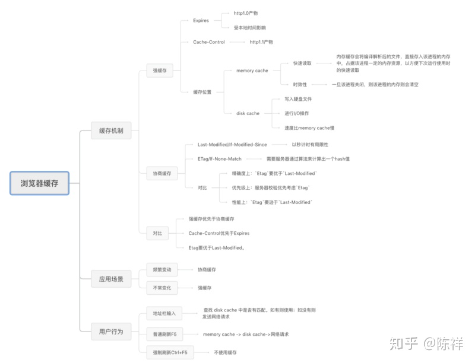
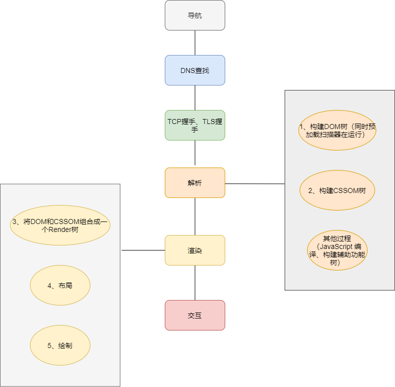

---

title: 前端性能优化

date: 2022-02-27

tags: 

- 性能优化

categories:

- 前端

---

## 介绍

性能优化通常是针对计算机运行效率上的优化，性能优化问题相比编写一般的应用逻辑来说，需要涉及到更多关于计算机基础知识，通常是面向计算机而不是面向人的设计问题，那么计算机网络、操作系统、编译原理、数据结构与算法各层次的计算机知识就派上用场了。（通常编写代码有三个层面的问题：第一个是要编写应对业务逻辑的代码、第二个层面是提高人的效率的代码，第三个层面是提高计算机的效率的代码）。

注意：性能优化中的时间在业务上一般理解为用户感知时间。

## 性能检测

性能检测工具与performance api的使用。

## 问题1：如何优化单应用的首页加载慢

### 1、查看导致加载速度慢的主要原因

首先需要了解浏览器加载资源的机制，比如：

- 浏览器的缓存机制

- 浏览器解析资源的机制

- 浏览器各个资源的加载、运行速度评估

从这几个方面可以初步发现影响性能的原因。

#### 浏览器的缓存机制

参考：[浏览器缓存看这一篇就够了](https://zhuanlan.zhihu.com/p/60950750)

#### 浏览器解析资源的机制

参考：[渲染页面：浏览器的工作原理](https://developer.mozilla.org/zh-CN/docs/Web/Performance/How_browsers_work)

### 2、额，最佳实践

- 减小资源大小：比如减少不必要的依赖，压缩资源
- 将某些js异步化：比如将当前不需要的js文件异步加载，给某些script标签添加defer、async属性
- 使用懒加载：比如：在超出视口范围的部分使用懒加载
- 优化DOM结构，这样减少回流
- 使用动画提高用户体验：比如进度提示条，加载状态提示
- 使用HTTP/2协议
- 使用CDN托管静态资源
- 跨域资源使用DNS-prefetch尝试在请求资源之前解析域名

