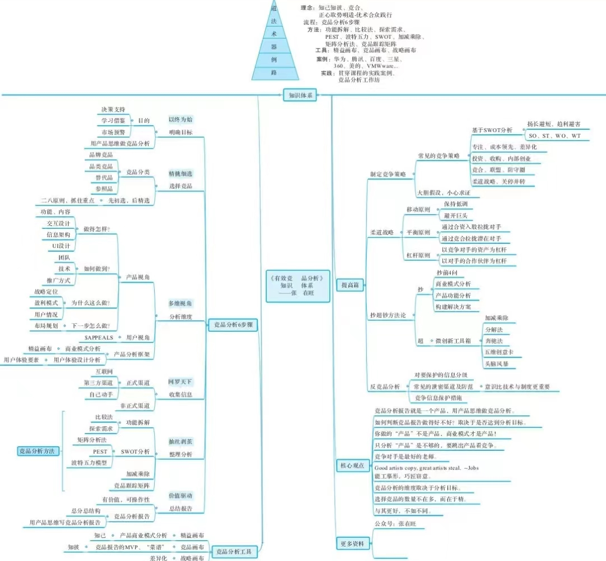

搞软件的开始就知道竞品分析这个概念了，但后来好几年都没在意，是因为和前端工作的关系不大。但现在想想不是的，竞品分析可是在生活、工作的方方面面。比如买东西货比三家、比如相亲择偶、比如工作中选择一个工具库、框架都需要进行比较。之前以为做产品最重要的是做好产品分析、用户体验分析，但产品要在市场上比较好地活下去还是要进行竞品分析，到底只要有利于产品的生存发展都可以作为考虑的因素。

有个比较明显的感受是受市场影响的供需平衡，比如买火车票、早点赶车，这些麻烦的直接原因是人都往一处地方去挤，造成很多生存发展的难题。

那么如何进行竞品分析呢？不是专业的产品人员几乎不用去做一份竞品分析报告，只希望有一个大概的轮廓，然后借助着思考。参考下面这张思维导图吧：

