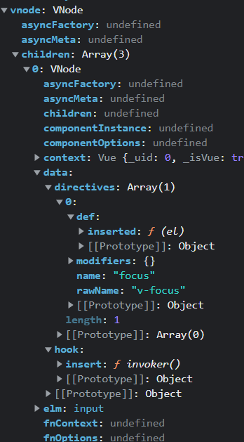

## 基本用法

对这一块平时用的少，不大熟悉。目前只知道vue指令是可以方便地对DOM进行操作。

来看看简单的使用吧，举个聚焦输入框的例子，如下：

当页面加载时，该元素将获得焦点 (注意：`autofocus` 在移动版 Safari 上不工作)。事实上，只要你在打开这个页面后还没点击过任何内容，这个输入框就应当还是处于聚焦状态。现在让我们用指令来实现这个功能：

```js
// 注册一个全局自定义指令 `v-focus`
Vue.directive('focus', {
  // 当被绑定的元素插入到 DOM 中时……
  inserted: function (el) {
    // 聚焦元素
    el.focus()
  }
})
```

如果想注册局部指令，组件中也接受一个 `directives` 的选项：

```
directives: {
  focus: {
    // 指令的定义
    inserted: function (el) {
      el.focus()
    }
  }
}
```

然后你可以在模板中任何元素上使用新的 `v-focus` property，如下：

```vue
<input v-focus>
```

更多使用方法参考vue官网文档：https://cn.vuejs.org/v2/guide/custom-directive.html

然后来了解一下源码的大概。

## 实现原理

先看看指令的执行堆栈，写个示例代码来调试源码：

```html
<!DOCTYPE html>
<html lang="en">

<head>
  <meta charset="UTF-8">
  <title>Title</title>
  <script src="./dist/vue.js"></script>
</head>

<body>
  <div id="app">
    <input v-if="showInput" v-focus>
    <button @click="onSwitchInput">切换</button>
  </div>

  <script>
    // 注册一个全局自定义指令 `v-focus`
    Vue.directive('focus', {
      // 当被绑定的元素插入到 DOM 中时……
      inserted: function (el) {
        debugger;
        // 聚焦元素
        el.focus()
      }
    })

    new Vue({
      el: '#app',
      data(){
        return {
          showInput: false
        }
      },
      methods: {
        onSwitchInput(){
          this.showInput = !this.showInput;
        }
      }
    })
  </script>
</body>

</html>
```

可以看到堆栈信息：


知道大体的vue的渲染思路，我们从 vnode 开始，我们看到调用了 patch方法，当将元素插入文档后，调用了`invokeInsertHook(vnode, insertedVnodeQueue, isInitialPatch);`，传入的vnode的结构是：



可以看到input标签对应的vnode上的data含有`directives`指令数组，每个指令的元数据有 rawName、name、modifiers、def钩子函数。

然后在patch的过程中调用了invokeCreateHooks函数，这里面的调用关系貌似比较深不好理解。通过cbs那里的钩子初始化最后执行 updateDirectives。这中间做了什么呢? 关于patch，不同平台有不同的API，并且在patch的几个钩子中做合适的事情，由此知道patch的过程中执行对应的钩子，而关于指令的钩子也在其中。

patch的钩子如下：

```js
const hooks = ['create', 'activate', 'update', 'remove', 'destroy']
```

而directives的相关钩子如下（这里不关心文件夹位置）：

```js
export default {
  create: updateDirectives,
  update: updateDirectives,
  destroy: function unbindDirectives (vnode: VNodeWithData) {
    updateDirectives(vnode, emptyNode)
  }
}
```

到这里就解释了当创建完成调用 invokeCreateHooks 函数底层是调用了 updateDirectives。

让我们来看看 updateDirectives 函数：

```js
function updateDirectives (oldVnode: VNodeWithData, vnode: VNodeWithData) {
  if (oldVnode.data.directives || vnode.data.directives) {
    _update(oldVnode, vnode)
  }
}
```

```js
function _update (oldVnode, vnode) {
  const isCreate = oldVnode === emptyNode
  const isDestroy = vnode === emptyNode
  const oldDirs = normalizeDirectives(oldVnode.data.directives, oldVnode.context)
  const newDirs = normalizeDirectives(vnode.data.directives, vnode.context)

  const dirsWithInsert = []
  const dirsWithPostpatch = []

  let key, oldDir, dir
  for (key in newDirs) {
    oldDir = oldDirs[key]
    dir = newDirs[key]
    if (!oldDir) {
      // new directive, bind
      callHook(dir, 'bind', vnode, oldVnode)
      if (dir.def && dir.def.inserted) {
        dirsWithInsert.push(dir)
      }
    } else {
      // existing directive, update
      dir.oldValue = oldDir.value
      dir.oldArg = oldDir.arg
      callHook(dir, 'update', vnode, oldVnode)
      if (dir.def && dir.def.componentUpdated) {
        dirsWithPostpatch.push(dir)
      }
    }
  }

  if (dirsWithInsert.length) {
    const callInsert = () => {
      for (let i = 0; i < dirsWithInsert.length; i++) {
        callHook(dirsWithInsert[i], 'inserted', vnode, oldVnode)
      }
    }
    if (isCreate) {
      mergeVNodeHook(vnode, 'insert', callInsert)
    } else {
      callInsert()
    }
  }

  if (dirsWithPostpatch.length) {
    mergeVNodeHook(vnode, 'postpatch', () => {
      for (let i = 0; i < dirsWithPostpatch.length; i++) {
        callHook(dirsWithPostpatch[i], 'componentUpdated', vnode, oldVnode)
      }
    })
  }

  if (!isCreate) {
    for (key in oldDirs) {
      if (!newDirs[key]) {
        // no longer present, unbind
        callHook(oldDirs[key], 'unbind', oldVnode, oldVnode, isDestroy)
      }
    }
  }
}
```

可以看到指令的几个钩子函数的调用时机。我们深入例子代码中的 inserted函数，调用了 `callHook(dirsWithInsert[i], 'inserted', vnode, oldVnode)`

最后调用 inserted 函数：

```
function callHook (dir, hook, vnode, oldVnode, isDestroy) {
  const fn = dir.def && dir.def[hook]
  if (fn) {
    try {
      fn(vnode.elm, dir, vnode, oldVnode, isDestroy)
    } catch (e) {
      handleError(e, vnode.context, `directive ${dir.name} ${hook} hook`)
    }
  }
}
```

其中dir的结构如下：

```
dir:
  def:
  inserted: ƒ (el)
  modifiers:
  无属性
  name: "focus"
  rawName: "v-focus"
  [[Prototype]]: Object
  fn: undefined
  hook: "inserted"
  isDestroy: undefined
```

> 至此就了解了指令的实现原理，即在patch阶段的的 create、update、destroy钩子调用对应的函数如：updateDirectives，最后调用对应的指令钩子函数。

---

接下来看看 vue 自带的一些指令实现，如 v-if、v-for、v-bind、v-model。


