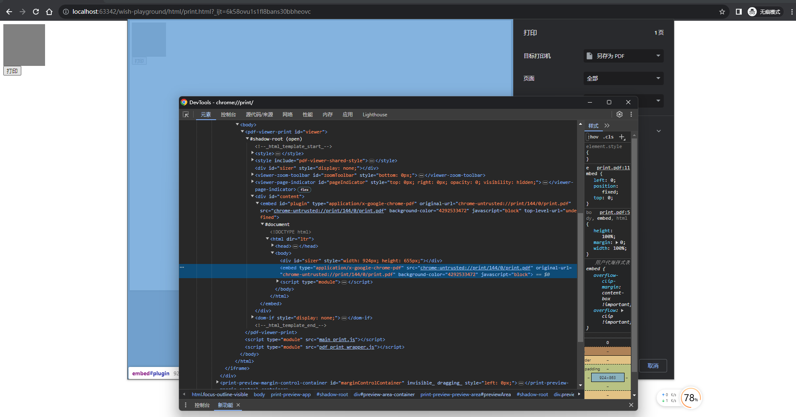

通常导出word,excel文档由后端处理会好处理一些，而且这两类文档如果放到前端处理会浪费很多成本，结果却不尽人意。那么导出pdf呢？按理后端也能搞，只要后端访问对应链接或者获取到对应的html+css那么就可以处理，但现在前端也支持导出pdf。从架构来说，前端负责视图效果和简单的数据处理，前端来搞会好一些，不同的视图要求导出的效果不一样，这需要前端来灵活调整。


导出pdf的方案有以下几种：

- 后端导出pdf
- 前端导出pdf
  - 借助浏览器的打印功能来导出
    - css媒体查询设置打印样式，将对应元素导出
    - 构建iframe的html和css，触发iframe的打印导出
    - 将body设置为对应元素，再触发打印导出
  - 使用`html2canvas`+`jsPDF`工具库来导出
    - 仅使用`jsPDF`，将dom节点和文字导出
    - 使用两者，将dom节点转成图片，再将图片转为pdf文件


一般来说，使用`html2canvas`+`jsPDF`工具库来导出会有更多的麻烦，比如需要处理图片模糊问题、需要处理样式错误问题（而且不好修复），需要处理中文乱码问题，丢失了 pdf 内容可搜索的特点。而借助浏览器的打印功能来导出没有明显的缺点（除了将body设置为对应元素，再触发打印导出）。

构建iframe的html和css，触发iframe的打印导出的这种方案，可能需要重新编写调用大量的css和html。那么一般来说最优的方案就是**css媒体查询设置打印样式，然后将对应元素导出。**


来看看它的基本原理：

- 使用媒体查询可区分打印样式和非打印样式，并可以做相应的处理
- 借助浏览器的打印功能导出pdf，默认打印body.innerHTML内容


下面来看看可能会遇到的问题：

1、想要打印局部内容

只需要根据媒体查询定义对应的css类，然后通过css类来控制显示要打印的内容。（当然还有其他方法）

```css
@media print {
  .print-hide-flag {
    display: none !important
  }
}
```

2、如何分页？

可以通过设置局部区域固定为A4纸的尺寸并且设置样式`overflow:hidden`，然后打印配置为A4纸大小，那么这样就会自动分页了。不过这种情况比较特殊，通用的做法是使用强制插入分页：

```css
@media print {
  .print-page-break-before {
    page-break-before: always;
  }
  .print-page-break-after {
    page-break-after: always;
  }
}
```

3、打印设置

使用`@page`设置尺寸、方向、边距。参考https://developer.mozilla.org/en-US/docs/Web/CSS/@page。

注意：

size是一个初始默认值，而当用户切换之后，下一次打印初始值是用户切换后的。

margin在谷歌浏览器中仅当size的值对应上，才会去掉页眉页脚。比如浏览器是A4，这里也写着A4。

```css
@media print {
  @page {
    size: A4 landscape;
    /* 去掉页眉 */
    margin-top: 0;
    /* 去掉页脚 */
    margin-bottom: 0;
    /* 去掉页眉和页脚 */
    margin: 0;
  }
}
```

还有很多属性，但页面模型还不是很确定，可能和盒子模型类似，但还是需要具体实践。

4、出现样式错误问题

`window.print` 出现样式丢失的原因可能有以下几种：

- [你的网页中没有引入打印样式，或者打印样式被其他样式覆盖了。你可以在CSS中使用@media print来定义打印样式，或者在HTML中使用标签来引入专门的打印样式文件。](https://juejin.cn/post/7071064879217508366)[1](https://juejin.cn/post/7071064879217508366)[2](https://www.cnblogs.com/goloving/p/13954873.html)[3](https://blog.csdn.net/qq_42778001/article/details/104450193)
- [你的网页中使用了一些不支持打印的属性或元素，比如background-image、visibility、position等。你可以在打印样式中将这些属性或元素设置为none或者其他合适的值。](https://www.cnblogs.com/goloving/p/13954873.html)[2](https://www.cnblogs.com/goloving/p/13954873.html)[3](https://blog.csdn.net/qq_42778001/article/details/104450193)
- [你的网页中使用了class类名来定义样式，但是标签嵌套太深，导致打印时无法识别。你可以把样式写在标签上，或者简化标签结构。](https://juejin.cn/post/7071064879217508366)[4](https://bing.com/search?q=window.print样式丢失)
- [你的网页中使用了iframe局部打印，但是iframe中的内容没有加载完毕，导致打印时缺失。你可以在iframe加载完成后再调用打印方法，或者使用其他方式实现局部打印。](https://blog.csdn.net/weixin_46446483/article/details/118251226)[5](https://blog.csdn.net/weixin_46446483/article/details/118251226)


4.1、背景色打印

```css
@media print {
  .print-area-box {
    -webkit-print-color-adjust: exact;
    -moz-print-color-adjust: exact;
    -ms-print-color-adjust: exact;
    print-color-adjust: exact;
  }
}
```

4.2 调用打印功能
调用`window.print()`会打开打印的预览页面，但这个方法没有参数可传，返回值是`undefined`。具体行为是：如果调用了`window.print()`时文档在加载，那么浏览器会等浏览器加载完文档再打开对话框，所以打印对话框打开时会发生阻塞。浏览器提供了调用`window.print()`前后的钩子函数，比如：

```js
window.addEventListener("afterprint", () => {
    // 在打印对话框关闭后的回调，不论点了确定还是取消了打印
});
```

由于打印预览页面通常是在一个单独的环境中渲染的，因此可能无法使用常规的JavaScript调试技术（如断点和控制台日志）来调试这些页面。

浏览器打印的原理是：浏览器获取到当前的已计算完的`dom`和`css`树得到一棵渲染树（只待将渲染树显示在屏幕。），然后把这个树放到浏览器一个单独的页面环境中渲染显示。


嗯。。。那怎么调试打印的预览页面呢？

- 目前能想到的办法是控制打印页面的样式选择器来调试
- 需要知道浏览器在打印预览模式下可能会忽略或覆盖一些CSS样式


4.3 浏览器兼容性问题

因为`window.print()`是浏览器的API，所以需要注意它的兼容性。主要还是样式问题，不同浏览器在打印页面的某些样式处理会不一样。比如：

- 在火狐浏览器使用absolute定位可能会失效


4.4 修改导出文件的标题

```js
let tmp = document.title
window.print()
document.title = tmp
```


