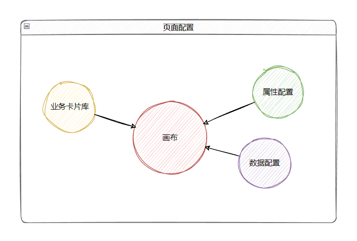
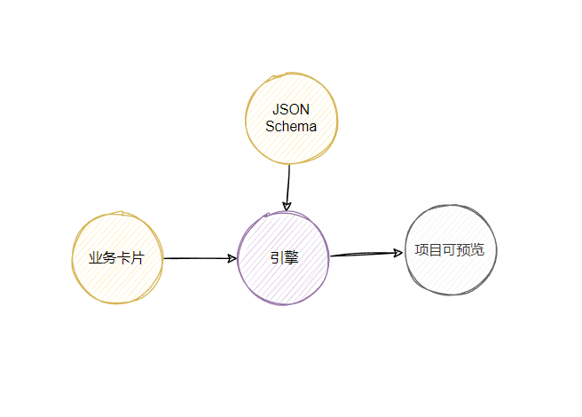
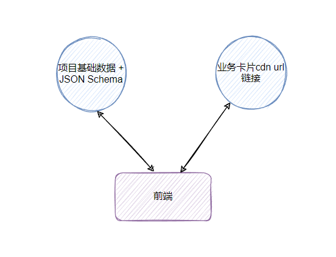

从软件构造的理论来说，软件是基于数据+指令方式的图灵机之上构造，是一种以特征点的形而下的方式构造的。这种方式在我看来也是道的本质。其中的关键点是来源于人类的局限，软件技术的发展由最低层的硬件、汇编、操作系统、编译系统、高级语言，抽象层次不断的接近人易理解和控制的方向上发展。有人会以自由度越来越低的维度来衡量，有人以类似的应用层、传输层、网络层、数据链路层、物理层的维度来描述。

通常上层确实比下层的自由度低，能够操控图灵机的能力更低，因为就算提供下层完备的API但是通过中间编译层次性能等方面都会下降。上层和下层对于软件质量是平衡点，这也需要平衡和考量场景。

上层是对人的效率高对图灵机的效率低，下层是对人的效率低但对图灵机的效率高。在图灵机有充足的资源可用，那么这时我们考虑提高上层对人的提效，在上层提供一个完备的集合来构造相应的应用软件。其实代码语言本身也是一种上层，代码的上层不可能是代码的直接外观映射，必然会有些细节隐藏。对于开发人员和目前的软件模块来说，开发人员通常要对这些细节控制。

目前低代码工具对于开发人员的提效是对同质化的功能需求，并且需要较高的移植性和扩展性。低代码对于业务人员来说需要应对业务场景：简单的有模拟数据的可视化汇报、复杂的有多个页面的真实数据的交互项目。

## 业务模型

用户有两类：业务人员、开发人员。

### 业务模型1

1. 开发人员上传业务卡片
2. 业务人员新建项目
3. 业务人员使用业务卡片，设置业务卡片
4. 业务人员发布项目

上面这个主要是对业务人员的提效，但没有考虑开发人员。

## 系统逻辑模型

### 业务卡片库

1. 业务卡片直接公开少量的属性和事件，提供静态数据

2. 业务卡片版本管理

3. 业务卡片远程加载
4. 业务卡片支持自适应

### 画布

1. 支持拖拽，布局

### 属性配置

1. 交互设置
2. 样式设置
3. 数据设置

### 数据设置

1. 支持静态数据、动态数据配置

## JSON Schema

1. 项目
2. 页面
3. 布局
4. 卡片/组件
5. 属性

## BS交互模型

